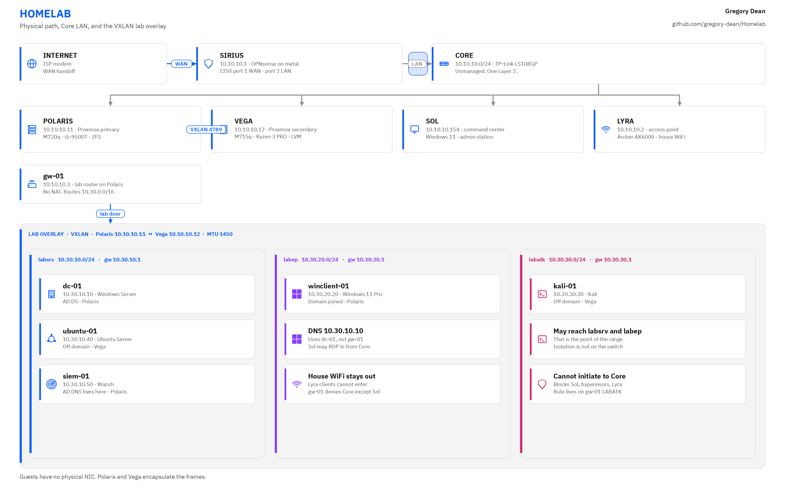
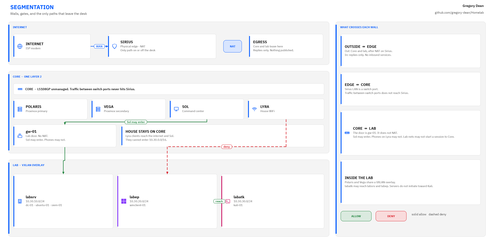

# Architecture

The lab is a 10 inch rack on my desk with an edge firewall, two Proxmox nodes, and the Windows desktop I manage all of it from. This page explains how those pieces connect and why the network is shaped the way it is.

<picture>
  <source media="(prefers-color-scheme: dark)" srcset="../images/diagrams/topology-dark.png">
  
</picture>

<picture>
  <source media="(prefers-color-scheme: dark)" srcset="../images/diagrams/segmentation-dark.png">
  
</picture>

## Physical path

Traffic comes in from the ISP modem and lands on Sirius, a Lenovo M720q with an i5-8400T that runs OPNsense directly on the hardware. A 10Gtek Intel I350 four port card handles both WAN and LAN. Port 1 goes to the modem, and port 2 goes to the switch as `10.10.10.1`.

The switch is a TP-Link LS108GP. It's unmanaged, so it can't do VLANs, and everything plugged into it shares a single Layer 2 network. I call that network Core.

From the switch, a 12 port keystone panel reaches the rest of the hosts:

- Polaris, a Lenovo M720q with an i5-9500T, running Proxmox
- Vega, a Lenovo M715q with a Ryzen 3 PRO 2200GE, also running Proxmox
- Sol, my Windows 11 desktop
- Lyra, an Archer AX6000 in access point mode

## Two OPNsense installs

There are two OPNsense installs in this lab, and they're easy to mix up. Only one of them is a physical machine.

Sirius is the physical edge. It owns the WAN connection, house internet, DHCP and DNS for Core, and NAT for both Core and the lab prefixes.

gw-01 is a virtual machine on Polaris. It routes the lab networks and nothing else, and it doesn't NAT. Its Core address is `10.10.10.3`.

The reason for the second install is that Sirius never sees traffic between two devices on the same switch. If isolation lived only on Sirius, a guest on the attack network could reach anything on Core without ever crossing a firewall. So the deny from the attack network to Core is a rule on gw-01, where every lab packet has to pass.

## Logical lab networks

Since the switch can't do VLANs, the lab runs as a VXLAN overlay between Polaris (`10.10.10.11`) and Vega (`10.10.10.12`) on UDP 4789.

| VNet | Prefix | Gateway | Use |
| ---- | ------ | ------- | --- |
| labsrv | `10.30.10.0/24` | `10.30.10.1` (gw-01) | Servers |
| labep | `10.30.20.0/24` | `10.30.20.1` (gw-01) | Endpoints |
| labatk | `10.30.30.0/24` | `10.30.30.1` (gw-01) | Attack box |

Guests on those vnets have no physical NIC. Polaris and Vega encapsulate the frames and carry them over Core, which is how `kali-01` on Vega can reach `dc-01` on Polaris.

Sirius holds static routes for the three lab prefixes via `10.10.10.3`, and hybrid source NAT on Sirius translates both `10.10.10.0/24` and `10.30.0.0/16` out the WAN.

## DNS

I run two DNS zones on purpose, and they do different jobs.

`home.gregory-dean.com` is Core. Unbound on Sirius owns it, listening on port 53 with DNSSEC and DNS over TLS upstream to 1.1.1.1 and 9.9.9.9. Dnsmasq on port 53053 handles DHCP and registers lease names, and Unbound forwards the Core zone to it.

`lab.gregory-dean.com` is Active Directory on `dc-01`. Sirius forwards that zone to `10.30.10.10`, which means Sol can resolve lab names without joining the domain.

## Command center

Sol is the only machine I administer from. I manage Proxmox, Sirius, gw-01, and Lyra from there, and SSH and the Proxmox UI only accept Sol (`10.10.10.154`) and the peer hypervisor. House WiFi clients on Lyra stay on Core and never enter the lab.

## Guests

Polaris holds `gw-01`, `dc-01`, `winclient-01`, and `siem-01`. Vega holds `ubuntu-01` and `kali-01`. I keep role names on the guests and star names on the metal so it's obvious at a glance which kind of thing I'm looking at.

Address tables and the patch map are in [network.md](network.md). The hardware list is in [hardware.md](hardware.md).
