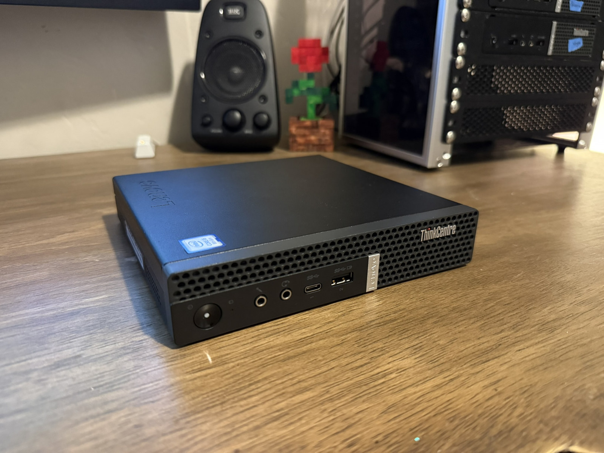
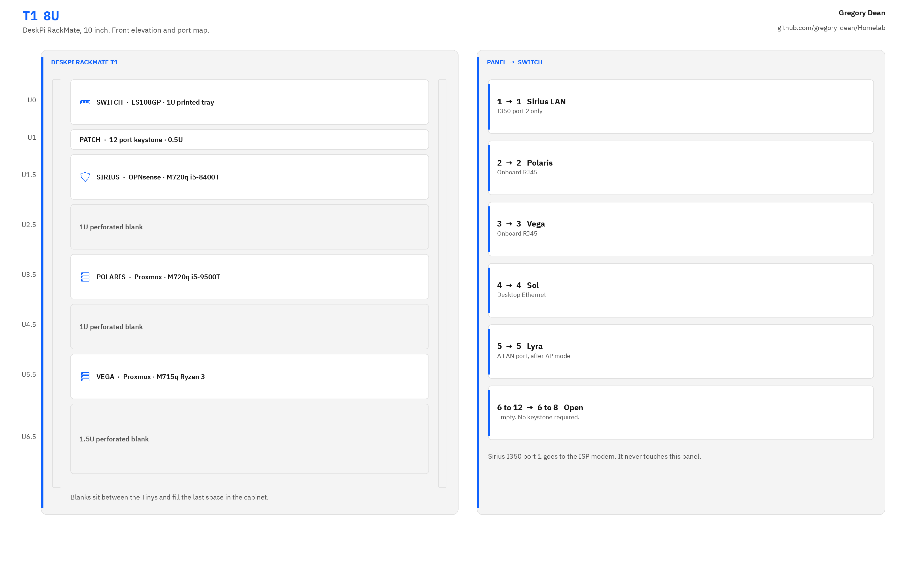
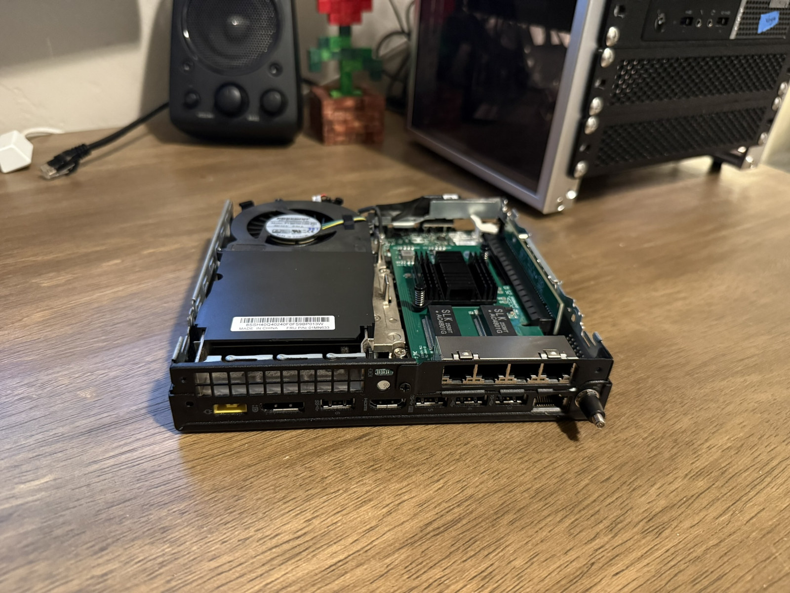

# Hardware

Everything in the rack and on the desk, with what I paid for the parts I bought.

<picture>
  <source media="(prefers-color-scheme: dark)" srcset="../images/diagrams/rack-dark.png">
  
</picture>

## Purchased

| Item | Role | Cost |
| ---- | ---- | ---- |
| DeskPi RackMate T1, 8U, 10 inch | Rack | $119.99 |
| Cat6A keystone coupler, 25 pack | Patch panel jacks | $35.99 |
| Wobeater 01AJ940 expansion riser | PCIe riser in Sirius | $22.49 |
| TP-Link LS108GP | Switch | $59.99 |
| Cat6A 0.5 ft patch cables, 10 pack | Panel to switch | $10.99 |
| Cat6A 2 ft patch cables, 10 pack | Rear device runs | $12.39 |
| Lenovo M720q, i5-9500T, 16 GB, 512 GB NVMe | Polaris chassis | $231.90 |
| Samsung 32 GB (2x16) DDR4-2666 SODIMM | Polaris RAM | $89.97 |
| Lenovo M720q, i5-8400T, 16 GB, 256 GB NVMe | Sirius | $132.49 |
| SK Hynix 32 GB (2x16) DDR4-3200 SODIMM | Vega RAM | $99.51 |
| Lenovo M715q, Ryzen 3 PRO 2200GE, 250 GB 2.5 inch SSD | Vega | $120.00 |
| 10Gtek 4 port 1 GbE adapter, Intel I350 | Sirius WAN and LAN | $64.99 |

Purchased total: $1000.70

Despite the name, the 10Gtek card is a gigabit adapter. It uses an Intel I350 controller and links at 1 Gbps.

## On hand

| Item | Role |
| ---- | ---- |
| Archer AX6000 | Lyra access point |
| Windows 11 desktop, Ryzen 7 5800X, 32 GB, RTX 3080 Ti, 3 TB+ NVMe | Sol, command center |
| ISP modem | WAN handoff to Sirius |
| Black PETG filament | All printed mounts |

Polaris shipped with 16 GB. Those sticks came out when the Samsung kit went in, and I keep them as spares.

## Hosts

Everything in these tables is running today. I don't list hardware I'm planning to buy or roles I might add later.

### Physical

| Name | Role | Hardware | Address |
| ---- | ---- | -------- | ------- |
| Sirius | Edge firewall | M720q i5-8400T, 16 GB, 256 GB NVMe, I350 | `10.10.10.1` |
| Polaris | Proxmox node | M720q i5-9500T, 32 GB, 512 GB NVMe | `10.10.10.11` |
| Vega | Proxmox node | M715q Ryzen 3 PRO 2200GE, 32 GB, 250 GB SSD | `10.10.10.12` |
| Sol | Command center | Ryzen 7 5800X, 32 GB, 3080 Ti | `10.10.10.154` |
| Lyra | Access point | Archer AX6000 | `10.10.10.2` |
| Switch | Core L2 | TP-Link LS108GP | none |
| Panel | Patch | 12 port keystone, 0.5U | none |

Sirius is a Lenovo M720q with an i5-8400T, 16 GB of RAM, and a 256 GB NVMe, and it runs OPNsense directly on the hardware. The I350 card sits on the Wobeater 01AJ940 riser. Port 1 is WAN and port 2 is LAN. Ports 3 and 4 and the onboard NIC are unused.

Polaris is a Lenovo M720q with an i5-9500T, 32 GB of DDR4-2666, and a 512 GB M.2 NVMe. It's the primary Proxmox node. The I350 originally lived in this machine, and after it moved to Sirius, Polaris runs on its onboard Ethernet alone.

Vega is a Lenovo M715q with a Ryzen 3 PRO 2200GE, 32 GB of DDR4-3200, and a 250 GB 2.5 inch SSD. It's the second Proxmox node.

Sol is my Windows 11 desktop and the admin station for everything here. It doesn't host any lab VMs.

Lyra is the Archer AX6000, running in access point mode.

### Guests

| Name | Node | Role | Address |
| ---- | ---- | ---- | ------- |
| gw-01 | Polaris | Lab router, OPNsense | `10.10.10.3`, `10.30.10.1`, `10.30.20.1`, `10.30.30.1` |
| dc-01 | Polaris | Windows Server, AD DS for `lab.gregory-dean.com` | `10.30.10.10` |
| winclient-01 | Polaris | Windows 11 Pro, domain joined | `10.30.20.20` |
| siem-01 | Polaris | Ubuntu Server, Wazuh | `10.30.10.50` |
| ubuntu-01 | Vega | Ubuntu Server, off domain | `10.30.10.40` |
| kali-01 | Vega | Kali, off domain | `10.30.30.30` |

## Storage

Polaris uses ZFS on its single NVMe drive. That gets me snapshots and checksums, but not redundancy. One disk is still one copy.

Vega uses ext4 with LVM thin on its SATA SSD. In the cluster, `local-lvm` is the Vega disk store and `local-zfs` stays pinned to Polaris.

## Mounts

Every printed part in the rack is black PETG. I designed the switch tray myself, but the Tiny trays and the patch panel come from Printables, and the model pages are linked below.

### Tiny PC trays (1U)

These hold Sirius, Polaris, and Vega.

- Model: [10 Inch Rack Mount for Lenovo Thinkcentre m920q (m720q) Tiny](https://www.printables.com/model/1384009-10-inch-rack-mount-for-lenovo-thinkcentre-m920q-m7)
- Designer: owlish
- Origin: a remix of Smelliot's M900 Tiny mount with the feet channels moved for the m920q and m720q footprint. The M715q in Vega fits the same tray.
- Print: faceplate down, 3 perimeters with a 0.4 mm nozzle, 0.25 mm layers, PETG. About 130 g each.
- Post processing: clip the sacrificial bridges so the screws pass through.
- Hardware: two M3x6 screws into the Tiny are optional. The rubber feet hold it on their own.

### Patch panel (0.5U)

- Model: [MiniRack 10 inch Blank Keystone Patch Panel](https://www.printables.com/model/1316293-minirack-10-inch-blank-keystone-patch-panel)
- Designer: Juraj
- Variant: 12 port
- Print: 0.2 mm layers, no supports, black PETG
- Jacks: Cat6A keystone couplers from the 25 pack

### Switch tray (1U)

This one is my own design, sized for the LS108GP.

### Rack

The cabinet is a DeskPi RackMate T1, 8U and 10 inches wide. From the top down it holds the switch tray, the 0.5U patch panel, Sirius, a 1U blank, Polaris, another 1U blank, Vega, and a 1.5U blank at the bottom.
