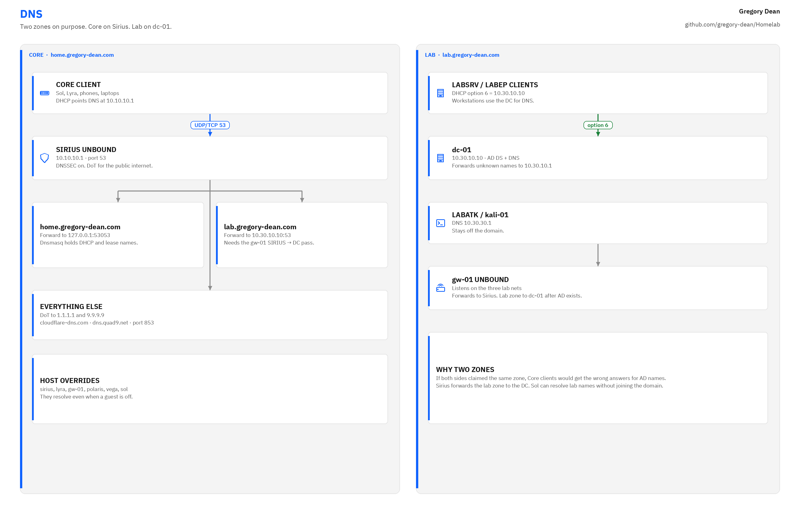

# Network

This is the address book for the lab: Core and lab addresses, DNS, the NIC assignments on Sirius, routes and NAT, firewall rule order, and the patch map.

<picture>
  <source media="(prefers-color-scheme: dark)" srcset="../images/diagrams/dns-dark.png">
  
</picture>

The segmentation view of the same network is in [architecture](architecture.md).

## Core (`10.10.10.0/24`)

Core is the physical LAN on the LS108GP. Its domain is `home.gregory-dean.com`, and Sirius provides both DHCP through Dnsmasq and DNS through Unbound.

| Address | Name | Device |
| ------- | ---- | ------ |
| `10.10.10.1` | sirius | M720q i5-8400T, OPNsense |
| `10.10.10.2` | lyra | Archer AX6000 |
| `10.10.10.3` | gw-01 | OPNsense VM on Polaris |
| `10.10.10.11` | polaris | M720q i5-9500T, Proxmox |
| `10.10.10.12` | vega | M715q Ryzen 3, Proxmox |
| `10.10.10.100` to `10.10.10.199` | DHCP pool | Phones, laptops, anything else on Core |
| `10.10.10.154` | sol | Ryzen 7 desktop, DHCP reservation on Sirius |

DHCP hands out `10.10.10.1` as the gateway, DNS server, and NTP server, with `home.gregory-dean.com` as the domain. Sol stays on DHCP, and a Dnsmasq reservation on Sirius makes sure it always gets `10.10.10.154`. Unbound listens on port 53. Dnsmasq listens on 53053 and registers lease names, and Unbound forwards the `home.gregory-dean.com` zone to it.

## Lab networks

The lab networks are virtual and routed by gw-01. The domain is `lab.gregory-dean.com`, served by `dc-01`.

| Address | Name | VNet | Notes |
| ------- | ---- | ---- | ----- |
| `10.30.10.1` | gw-01 | labsrv | Lab server gateway |
| `10.30.10.10` | dc-01 | labsrv | Windows Server, AD DS |
| `10.30.10.40` | ubuntu-01 | labsrv | Ubuntu Server, off domain |
| `10.30.10.50` | siem-01 | labsrv | Ubuntu Server, Wazuh |
| `10.30.20.1` | gw-01 | labep | Endpoint gateway |
| `10.30.20.20` | winclient-01 | labep | Windows 11 Pro, domain joined |
| `10.30.30.1` | gw-01 | labatk | Attack gateway |
| `10.30.30.30` | kali-01 | labatk | Kali, off domain |

gw-01 runs DHCP on each lab network with a pool from `.100` to `.199`.

Workstations use `10.30.10.10` for DNS, and Kali uses `10.30.30.1`. Unbound on both Sirius and gw-01 forwards `lab.gregory-dean.com` to `10.30.10.10`. DHCP option 6 on LABSRV and LABEP also points at `10.30.10.10`, while LABATK stays on `10.30.30.1`.

## Sirius NIC assignment

Sirius has the 10Gtek Intel I350, which uses the `igb` driver, plus the onboard NIC.

| Port | Role |
| ---- | ---- |
| I350 port 1 | WAN to the ISP modem |
| I350 port 2 | LAN to the switch, `10.10.10.1` |
| I350 ports 3 and 4 | unused |
| Onboard | unused |

I confirmed which `igb` device was which at the console by plugging in one cable at a time, and the bracket is labeled to match.

## Routes and NAT

On Sirius:

- `10.30.10.0/24` via `10.10.10.3`
- `10.30.20.0/24` via `10.10.10.3`
- `10.30.30.0/24` via `10.10.10.3`
- Hybrid source NAT for `10.10.10.0/24` (automatic) and `10.30.0.0/16` (manual) out WAN

gw-01 does no outbound NAT. Its default route is `10.10.10.1`.

## Firewall intent

These are the Sirius LAN rules in order, and the first match wins. The default "allow LAN to any" rule is disabled. Access to the GUI and SSH comes from the Sol rule rather than from binding the listener to LAN, and anti lockout stays on. Anything that doesn't match rules 1 through 9 is denied.

1. Core to Sirius TCP/UDP 53 (Unbound)
2. Core to Sirius UDP 123 (NTP)
3. Core to Sirius ICMP
4. Sol to Sirius TCP 443 and 22
5. Sol to Polaris and Vega TCP 8006, 22, 5900 to 5999
6. Sol to gw-01 TCP 443 and 22
7. Sol to `10.30.0.0/16` any
8. Core to any destination not `10.10.10.0/24` and not `10.30.0.0/16` (house internet)
9. Lab prefixes to any destination not Core (lab internet)

gw-01 is where the lab is separated from Core:

- Sol may enter the lab
- Other Core clients may not
- Sirius may ping gw-01 for route monitoring
- Sirius may reach `dc-01` on TCP/UDP 53 so Unbound can answer lab names on Core
- Lab networks may not initiate to Core
- `labatk` may reach `labsrv` and `labep`, since attacking those is the whole point of the range

## Patch panel and switch

The rear of the panel is wired once and left alone. Front cords are 0.5 ft Cat6A to the switch, and the rear runs to each device are 2 ft Cat6A.

| Panel | Switch | Device |
| ----- | ------ | ------ |
| 1 | 1 | Sirius LAN |
| 2 | 2 | Polaris |
| 3 | 3 | Vega |
| 4 | 4 | Sol |
| 5 | 5 | Lyra |
| 6 to 12 | 6 to 8 | open |

On the LS108GP, Extend mode and PoE Auto Recovery are both off. Lyra runs from its own power brick, so PoE goes unused.

## VXLAN

The zone is `lab` on both Proxmox nodes, with peers `10.10.10.11` and `10.10.10.12` and an MTU of 1450. The vnets are `labsrv`, `labep`, and `labatk`. I don't create extra Linux bridges for the lab, because a bridge with no physical NIC only exists on one node.
